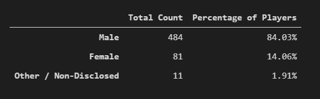
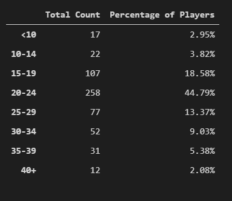
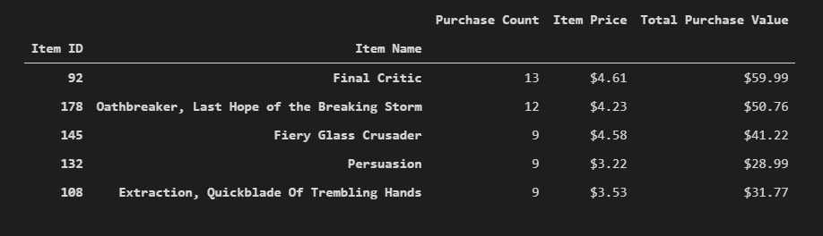
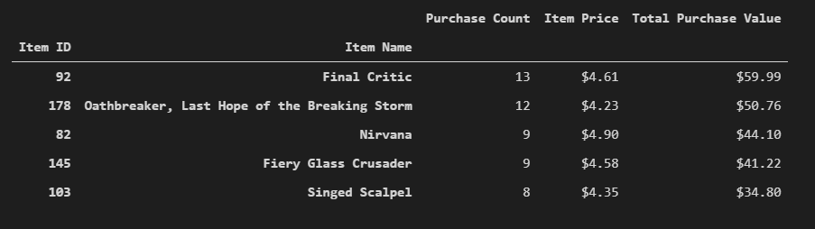

# pandas-challenge
### Overview:
The company would like you to generate a report that breaks down the game's purchasing data into meaningful insights. I am assigned the task of analyzing the data for their most recent fantasy game Heroes of Pymoli.

### Purpose: 
I am assigned the task of analyzing the data for their most recent fantasy game Heroes of Pymoli. I will be gathering the player count, purchasing analysis(age, total, gender), gender & age demographics, top spenders, and the most popular and profitable items.

### Observation/Conclusion:
Of the total amount of players 84% were male.
The highest percentage of players fall in the 20-24 age range.
The item "Oathbreaker, Last Hope of the Breaking Storm is the most popular, and it is also the most profitable.

